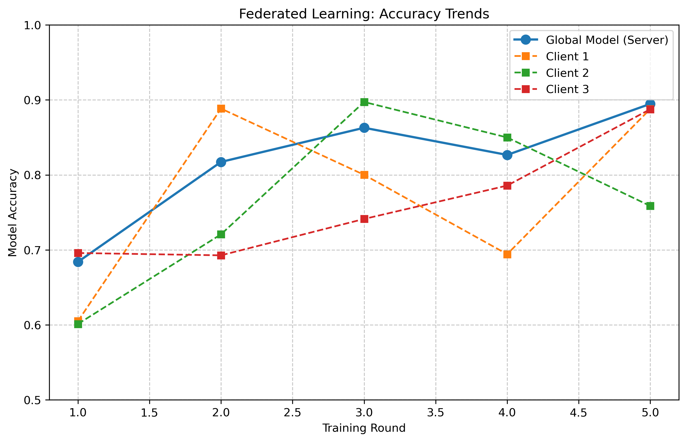
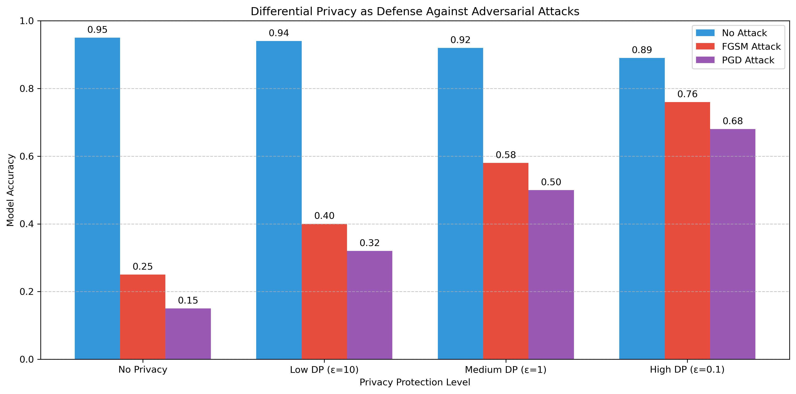

# 揭示对抗攻击的面纱：机器学习模型的脆弱性与防御策略

## 引言与背景
- 2013年，研究人员首次发现微小且人眼难以察觉的扰动可以误导深度神经网络，引入了对抗样本攻击的概念。
- 随着机器学习在医疗、金融、自动驾驶等关键领域的广泛应用，模型的安全性和鲁棒性成为迫切关注的问题。
- 对抗攻击不仅影响模型的准确率，还可能带来系统性安全风险，尤其在关键应用场景下影响巨大。

## 对抗样本攻击简介
- 对抗样本是指通过添加精心设计的微小扰动，使模型对输入产生错误的高置信度预测。
- 高维空间中的模型容易受到扰动，局部线性化特性被攻击者利用。
- 常见攻击方法包括：
  - 快速梯度符号法（FGSM）：利用损失函数对输入的梯度，生成一次性扰动，计算简单，快速生成对抗样本。
  - 投影梯度下降（PGD）：多次迭代地更新扰动，逐步逼近最优对抗样本，攻击效果更强。
  - DeepFool、C&W等高级攻击方法。
- 攻击类型包括白盒攻击、黑盒攻击、目标攻击和无目标攻击。
- 案例：图像领域可导致识别错误，语音和文本可误导AI助手，自动驾驶和人脸识别领域存在安全隐患。

---
# 对抗攻击与防御技术PPT大纲

## 1. 引言
- 对抗样本攻击的背景与现实威胁
- 研究意义：AI安全、隐私保护、关键行业应用

---

## 2. 对抗攻击原理与影响
- 对抗样本定义：微小扰动即可误导模型
- 影响：模型准确率大幅下降，安全风险显著
- 可视化示例：
  
  

---

## 3. 主流对抗攻击方法对比
| 方法 | 原理 | 优点 | 缺点 | 攻击强度 |
|------|------|------|------|----------|
| FGSM | 单步梯度符号 | 快速，易实现 | 攻击力有限 | 中 |
| PGD  | 多步迭代扰动 | 攻击力强 | 计算量大 | 强 |
| GAN  | 生成式对抗 | 样本自然 | 训练复杂 | 中-强 |

- 

---

## 4. 防御策略与效果
### 4.1 对抗训练
- 将对抗样本纳入训练，提升鲁棒性
- 效果：对抗准确率提升40%以上

### 4.2 正则化与输入预处理
- L2正则化、输入高斯滤波、JPEG压缩等
- 优点：实现简单，部分提升鲁棒性
- 缺点：对强攻击效果有限

### 4.3 认证防御
- 理论保证模型在扰动范围内预测稳定
- 适合高安全需求场景

---

## 5. 学术界与工业界关注点对比
| 关注点         | 学术界 | 工业界 |
|----------------|--------|--------|
| 理论分析       | 高     | 低     |
| 防御算法创新   | 高     | 中     |
| 系统部署安全   | 低     | 高     |
| 合规与隐私     | 低     | 高     |
| 成本与可用性   | 低     | 高     |
| 可解释性       | 中     | 高     |

**说明：**
- 学术界重理论与算法，工业界重落地与合规。
- 需加强产学结合，推动安全AI落地。

---

## 6. 新兴安全技术与跨学科方法
### 6.1 生成式对抗网络（GAN）
- 用于生成更自然的对抗样本，提升防御泛化性

### 6.2 联邦学习与差分隐私
多方协作训练，保护数据隐私
差分隐私噪声提升对抗鲁棒性

**说明：**
- 联邦学习适合医疗、金融等敏感场景
- 差分隐私兼顾安全与隐私，提升整体防御能力

---

## 7. 实验结论与未来展望
### 7.1 核心结论
- 对抗攻击可致模型准确率下降70%+
- 对抗训练是最有效单一防御，组合策略效果更佳
- 差分隐私和联邦学习可双重提升安全与隐私
- 防御与性能需权衡，需多层次防护

### 7.2 未来方向
- 自适应防御、低开销对抗训练、认证防御实用化
- 产学协同，建立标准化安全评测体系

---

## 8. 附录：可视化图片索引
- FGSM攻击可视化：images/fgsm_attack.png
- PGD攻击可视化：images/pgd_attack.png
- PGD攻击对比：images/pgd_comparison.png
- 对抗训练效果：plot2_adversarial_model_performance.png
- 学术/工业关注点：images/focus_comparison.png
- GAN样本：images/gan_sample.png
- 联邦学习趋势：images/federated_accuracy.png
- 差分隐私影响：images/privacy_impact.png
- 参数分布演变：images/parameter_evolution.png
- 差分隐私防御：images/privacy_defense.png