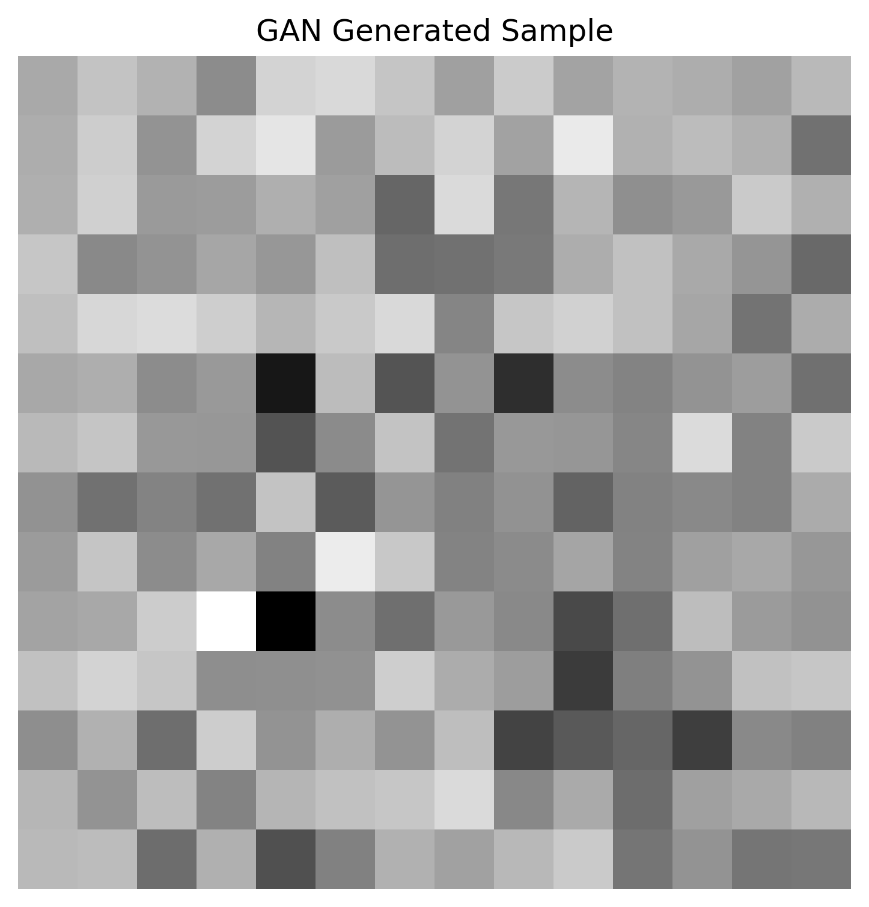
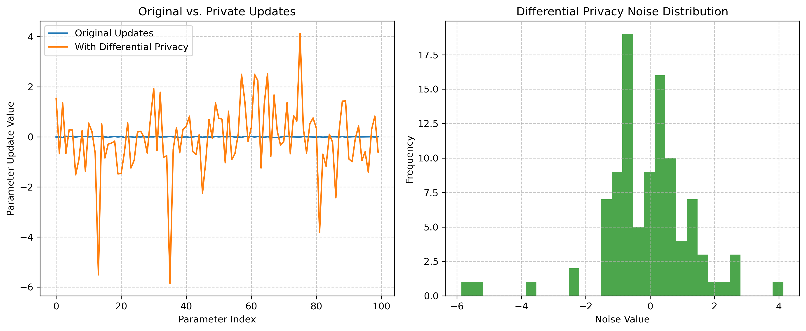
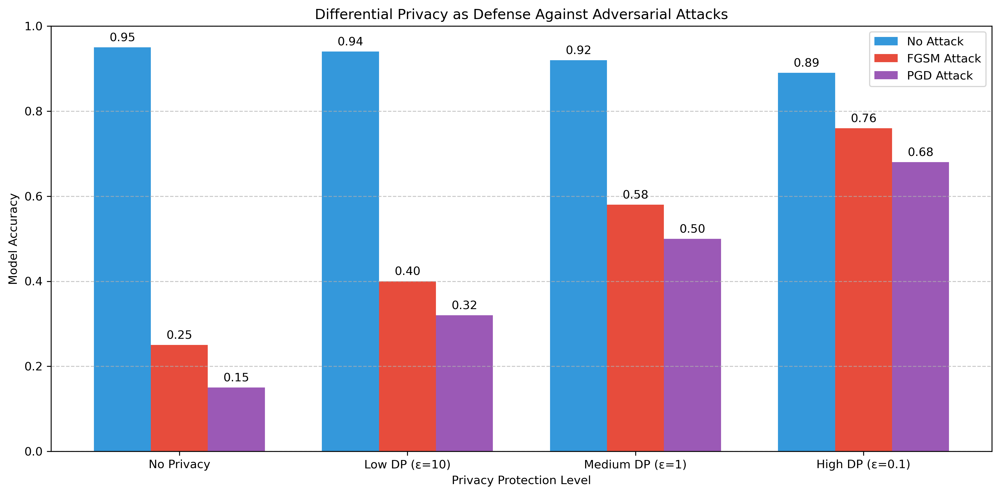

# **揭示对抗攻击的面纱：机器学习模型的脆弱性与防御策略综述**

---

## 摘要

随着机器学习技术在诸多关键领域的广泛应用，其安全性与鲁棒性问题日益凸显。对抗样本攻击作为一种针对机器学习模型的潜在威胁，能够通过引入人眼难以察觉的微小扰动，导致模型产生错误的预测。本文旨在系统性地梳理对抗样本攻击的相关知识，首先介绍了对抗攻击的基本概念、产生机制以及模型的内在脆弱性；接着，详细阐述了包括快速梯度符号法（FGSM）、投影梯度下降（PGD）、DeepFool及Carlini & Wagner（C&W）在内的多种典型攻击方法，并分析了白盒、黑盒、目标与无目标等不同攻击类型；随后，分类探讨了现有的防御策略，涵盖模型增强（如对抗训练、正则化）、输入预处理与检测、以及提供数学保障的认证防御等方法；进一步地，本文关注了学术界与工业界在对抗攻防领域的研究重点与实践应用；最后，展望了生成式对抗网络（GAN）、集成学习、生物启发防御及结合联邦学习与差分隐私等有前途的安全技术方向。本文强调了持续研究与跨界合作对于提升机器学习模型安全性的重要意义。

**关键词：** 机器学习安全，对抗样本，对抗攻击，对抗防御，模型鲁棒性

---

## 1. 引言

近年来，机器学习（Machine Learning, ML），尤其是深度学习（Deep Learning, DL），已渗透到现代科技的各个角落，从图像识别、自然语言处理到医疗诊断、金融风控和自动驾驶汽车，其强大的能力正在重塑我们的世界。然而，随着这些智能系统日益融入关键基础设施和社会生活，它们的安全性、可靠性和鲁棒性问题也变得空前重要，成为学术界与工业界无法回避的核心议题。

早在2013年，Szegedy等人[1]首次揭示了一个令人不安的现象：即使是对训练有素的深度神经网络，只需对其输入施加精心设计的、人眼几乎无法察觉的微小扰动，就可能导致模型以极高的置信度给出完全错误的预测。这种被恶意修改的输入被称为“对抗样本”（Adversarial Examples）。这一开创性发现暴露了当前主流机器学习模型在面对蓄意干扰时令人惊讶的脆弱性。后续研究，如Goodfellow等人[2]的工作，进一步探讨了其产生机制和利用方式。

对抗样本的存在对机器学习系统的可靠性构成了直接威胁。更令人担忧的是，在安全攸关（safety-critical）的应用场景中，这种脆弱性可能导致灾难性后果，例如自动驾驶汽车因对抗样本干扰而错误识别交通标志，或者医疗影像分析系统被误导做出错误的诊断。此外，研究还发现对抗样本具有一定的迁移性，即在一个模型上生成的对抗样本可能同样有效地欺骗其他结构不同、甚至训练数据不同的模型[6]，这极大地增加了攻击的潜在范围和隐蔽性。

面对这一严峻挑战，深入理解对抗样本的生成原理、准确评估其对模型性能的潜在影响、并积极探索和部署有效的防御策略，已成为保障机器学习系统安全可靠运行的当务之急。本综述旨在系统性地梳理对抗样本攻击与防御领域的核心知识，涵盖基本概念、典型攻击方法、主流防御技术，并探讨该领域的研究前沿与未来发展趋势，以期为相关研究人员和工程技术人员提供一份全面的参考指南。

---

## 2. 对抗样本攻击原理与方法

### 2.1 攻击机制与模型脆弱性

对抗样本攻击的核心在于利用机器学习模型，特别是深度神经网络（DNNs）的内在特性和潜在弱点。攻击者通过向原始良性输入（如图像、文本或音频）添加精心设计的、通常人难以察觉的微小扰动（Perturbation），诱导模型做出错误的预测或行为。

模型之所以容易受到对抗样本的攻击，其根源可以归结为几个方面：

1.  **高维输入空间的特性**：机器学习模型通常处理高维数据。在高维空间中，即使每个维度的扰动很小，累积起来也可能导致样本点在特征空间中发生显著位移，从而跨越模型的决策边界。Szegedy等人[7]首次系统地揭示了这一现象，发现高维空间中存在大量低概率的“对抗性凹陷区域”。
2.  **模型的局部线性与非线性**：Goodfellow等人[1]提出，模型的局部线性行为是导致其易受攻击的一个重要原因。即使是高度非线性的模型（如DNN），在局部区域也可能表现出近似线性的行为，这使得基于梯度的攻击方法（如FGSM）能够有效地找到导致错误分类的方向。然而，模型的非线性也使得决策边界变得极其复杂，为寻找微小扰动提供了可能。
3.  **模型学习的特征与人类感知的差异**：模型学习到的用于分类的判别性特征可能与人类理解和感知的特征存在差异。模型可能依赖于一些对人类来说不重要但对模型预测至关重要的微小模式或纹理。对抗扰动正是利用了这一点，针对性地修改这些模型敏感的特征，而这些修改往往不影响人类的判断[8]。
4.  **训练数据分布的局限性**：模型是在有限的训练数据上学习得到的。训练数据通常只覆盖了输入空间中一个很小的流形（manifold）。在数据点密集区域，模型表现良好，但在数据稀疏或未覆盖的区域（off-manifold），模型的行为可能缺乏泛化性，容易被对抗样本利用[3]。

### 2.2 常见攻击方法

对抗攻击算法的设计目标是在满足特定扰动约束（如 $L_p$ 范数限制）的前提下，有效地使模型产生错误输出。根据攻击者掌握的模型信息、攻击目标以及扰动约束的不同，研究人员设计了多种多样的对抗攻击算法。以下是一些代表性的方法，涵盖了从早期经典到当前基准的多种技术：

-   **快速梯度符号法（Fast Gradient Sign Method, FGSM）**[1]
    *   **核心思想**：利用模型损失函数 $J$ 在输入 $x$ 附近的局部线性假设，沿梯度符号方向一步更新生成扰动。
    *   **扰动计算**：
        $$ \delta = \epsilon \cdot sign(\nabla_x J(\theta, x, y)) $$
        其中：
        *   $\epsilon$：控制 $L_\infty$ 范数扰动大小的超参数。
        *   $\nabla_x J(\theta, x, y)$：损失函数关于输入 $x$ 的梯度。
        *   $sign(\cdot)$：符号函数。
        *   $\theta$：模型参数。
        *   $y$：真实标签。
    *   **对抗样本**：$x_{adv} = x + \delta$。
    *   **特点**：计算简单高效（一次反向传播），是快速基线攻击，但攻击性相对较弱。

-   **基本迭代法（Basic Iterative Method, BIM）/ 迭代FGSM（Iterative FGSM, I-FGSM）**[9]
    *   **核心思想**：将FGSM的单步更新分解为多步小步长迭代，并在每步后将扰动限制在 $\epsilon$-邻域内。
    *   **迭代更新**：
        $$ x^{t+1}_{adv} = Clip_{x, \epsilon} (x^t_{adv} + \alpha \cdot sign(\nabla_x J(\theta, x^t_{adv}, y))) $$
        其中：
        *   $x^t_{adv}$：第 $t$ 步的对抗样本。
        *   $\alpha$：单步迭代的步长，通常 $\alpha < \epsilon$。
        *   $Clip_{x, \epsilon}(\cdot)$：将结果裁剪（clip）或投影（project）回原始样本 $x$ 的 $\epsilon$-邻域内。
    *   **特点**：攻击性通常强于FGSM，是许多更复杂攻击的基础。

-   **动量迭代法（Momentum Iterative Method, MIM）**[16]
    *   **核心思想**：在BIM/I-FGSM中引入动量项，以稳定更新方向并帮助逃离局部最优点。
    *   **梯度累积**：
        $$ g_{t+1} = \mu \cdot g_t + \frac{\nabla_x J(\theta, x^t_{adv}, y)}{\|\nabla_x J(\theta, x^t_{adv}, y)\|_1} $$
    *   **迭代更新**：
        $$ x^{t+1}_{adv} = Clip_{x, \epsilon} (x^t_{adv} + \alpha \cdot sign(g_{t+1})) $$
        其中：
        *   $g_t$：第 $t$ 步累积的梯度。
        *   $\mu$：动量衰减因子。
    *   **特点**：生成的对抗样本通常具有更好的迁移性，在黑盒攻击中效果显著。

-   **投影梯度下降（Projected Gradient Descent, PGD）**[3]
    *   **核心思想**：带有随机初始化的迭代攻击方法，被认为是当前最强的一阶白盒攻击之一。
    *   **关键步骤**：
        1.  **随机初始化**：在 $x$ 的 $\epsilon$-邻域内随机选择一个点 $x^0_{adv}$ 作为起点。
        2.  **迭代更新**：类似BIM，进行多步梯度上升（最大化损失）。
        3.  **投影**：每步迭代后，将结果投影（Project）回 $x$ 的 $\epsilon$-邻域（$L_p$ 球）内。
    *   **特点**：攻击效果强大可靠，常作为评估模型鲁棒性的标准基准，也是对抗训练的核心。

-   **DeepFool**[8]
    *   **核心思想**：寻找将输入样本推过最近决策边界所需的最小 $L_2$ 范数扰动。
    *   **方法**：基于几何直觉，迭代地线性化分类器，计算并移动到决策边界的最小距离向量。
    *   **特点**：能高效生成极小 $L_2$ 范数的对抗样本，适用于精确控制 $L_2$ 扰动的场景，主要用于无目标攻击。

-   **Carlini & Wagner（C&W）攻击**[10]
    *   **核心思想**：将寻找对抗样本形式化为优化问题，平衡错误分类和扰动大小。
    *   **优化目标**（以 $L_2$ 攻击为例）：
        $$ \min \|\delta\|_2^2 + c \cdot f(x+\delta) $$
        其中：
        *   $\delta$：对抗扰动。
        *   $f(x+\delta)$：一个促使模型错误分类的损失函数（例如，$\max(\max_{i \neq t} \{Z(x+\delta)_i\} - Z(x+\delta)_t, -\kappa)$，其中 $Z(\cdot)$ 是logit输出，$t$ 是目标类别，$\kappa$ 是置信度参数）。
        *   $c$：平衡扰动大小和攻击成功率的超参数。
    *   **特点**：攻击成功率极高，能生成高质量、低扰动的对抗样本（尤其 $L_2$），是评估防御策略的强力武器，但计算成本较高。

-   **雅可比显著图攻击（Jacobian-based Saliency Map Attack, JSMA）**[11]
    *   **核心思想**：针对 $L_0$ 范数（最小化修改特征数量）的目标攻击。
    *   **方法**：利用雅可比矩阵计算特征显著性，贪婪地选择并修改少量最显著特征以达到目标分类。
    *   **特点**：旨在用最少特征修改实现攻击，适用于扰动稀疏性场景，计算复杂度较高。

-   **通用对抗扰动（Universal Adversarial Perturbations, UAP）**[17]
    *   **核心思想**：寻找一个单一的、固定的扰动向量 $\delta$，能大概率欺骗模型对数据集中大部分不同样本的分类。
    *   **方法**：通过迭代优化过程，在大量样本上累积能导致错误分类的扰动方向。
    *   **特点**：揭示了模型脆弱性的系统性偏差，具有跨样本的通用性，但计算量大，扰动范数可能较大。

-   **单像素攻击（One-pixel Attack）**[18]
    *   **核心思想**：极端的 $L_0$ 攻击，仅修改单个像素（位置和颜色）来欺骗模型。
    *   **方法**：通常使用差分进化等演化算法搜索最佳修改方案。
    *   **特点**：展示了模型对极微小局部扰动的敏感性，计算开销大。

-   **AutoAttack**[19, 20]
    *   **核心思想**：一个标准化的、强大的对抗攻击**组合**，旨在提供可靠且无需调参的鲁棒性评估基准。
    *   **组成**：包含多个互补的攻击方法，如APGD-CE (基于交叉熵损失的PGD变种), APGD-T (针对目标的PGD变种), FAB-T (快速自适应边界攻击), Square Attack (一种有效的无梯度查询攻击)。
    *   **特点**：被广泛认为是评估模型鲁棒性的最强公开基准之一，简化了评估过程。

### 2.3 攻击类型

对抗攻击可以根据不同的维度进行分类：

-   **根据攻击者知识（Attacker's Knowledge）**：
    -   **白盒攻击（White-box Attack）**：攻击者完全了解目标模型的所有信息，包括模型架构、参数、训练数据（有时）以及防御机制（如果存在）。上述介绍的基于梯度的攻击（FGSM, PGD, C&W, JSMA等）通常属于白盒攻击。
    -   **黑盒攻击（Black-box Attack）**：攻击者对模型的内部细节一无所知或知之甚少，只能通过模型的输入输出来进行攻击。常见的黑盒攻击策略包括：
        -   **基于迁移性的攻击（Transfer-based Attacks）**：利用对抗样本的迁移性[6]。攻击者在本地训练一个替代模型（Surrogate Model），或使用已知的预训练模型，生成对抗样本，然后将其用于攻击目标黑盒模型。这种方法的有效性依赖于不同模型间对抗扰动的可迁移程度。
        -   **基于查询的攻击（Query-based Attacks）**：攻击者通过多次查询目标模型来获取信息。例如，可以通过查询来估计梯度方向（Zeroth Order Optimization, ZOO）[12]，或者基于模型的输出分数（Score-based）或最终决策结果（Decision-based）来迭代优化扰动。这类攻击通常需要大量查询，但不需要了解模型内部结构。

-   **根据攻击目标（Attacker's Goal）**：
    -   **无目标攻击（Untargeted Attack）**：攻击者的目标是使模型对输入产生任何错误的分类即可，不关心具体错分成哪一类。
    -   **目标攻击（Targeted Attack）**：攻击者希望模型将输入误分类为某个特定的、预先指定的目标类别。目标攻击通常比无目标攻击更难实现，需要更精确地控制扰动方向。

-   **根据攻击域（Attack Domain）**：
    -   **数字攻击（Digital Attack）**：直接修改输入的数字表示（如图像的像素值、文本的词嵌入向量）。这是最常见的攻击形式，大多数攻击算法在此场景下提出。
    -   **物理世界攻击（Physical Attack）**：攻击发生在物理世界中。例如，打印带有对抗扰动的图像并用摄像头拍摄[9]，制作对抗性补丁（Adversarial Patch）贴在物体上[13]，或者通过扬声器播放对抗性音频。物理攻击需要考虑光照、角度、距离、打印/播放失真等现实因素带来的噪声和变换，通常比数字攻击更具挑战性，但也更贴近实际威胁场景。

### 2.4 案例分析与实例演示

对抗样本攻击的潜在危害已在多个领域得到证实，其影响不仅停留在理论层面，更在实际应用中构成威胁。

-   **图像识别**：
    -   **经典案例**：Szegedy等人[7]首次展示了微小扰动可以使模型将“校车”识别为“鸵鸟”。Goodfellow等人[1]展示了在ImageNet数据集上，对熊猫图像添加精心设计的、人眼几乎无法察觉的扰动，导致模型将其误识别为“长臂猿”的著名例子。
    -   **物理世界攻击**：研究表明，通过打印带有对抗扰动的图像或制作对抗性贴纸（Adversarial Patch）并将其放置在物理环境中（例如贴在停止标志上），可以成功欺骗自动驾驶汽车的视觉系统，使其做出错误的判断（如将“停止”识别为“限速”）[9, 13]，这对交通安全构成了严重威胁。

-   **语音识别**：向音频信号中添加人耳难以察觉的噪声，可以诱导语音助手（如Siri, Alexa, Google Assistant）执行非预期甚至恶意的指令，例如将其误识别为“打开某个恶意网站”或进行非授权操作[14]。

-   **自然语言处理（NLP）**：在文本领域，通过同义词替换、添加/删除/修改少量字符或单词，或者引入看似无意义的控制字符，可以改变文本情感分析的结果、规避垃圾邮件和恶意内容过滤器、生成误导性的文本摘要或欺骗机器翻译和问答系统[15]。

-   **实例演示 (`Attacks.ipynb`)**：
    -   **场景**：为了直观展示对抗攻击的效果，我们在 `Attacks.ipynb` 文件中进行了一个实验。该实验使用了一个简单的卷积神经网络（SimpleCNN），并在广泛使用的 CIFAR-10 数据集上进行了训练。
    -   **攻击方法**：我们采用了经典的 **快速梯度符号法（FGSM）**[1] 来生成对抗样本。具体地，针对测试集中的原始图像，我们计算模型损失函数关于输入的梯度，并沿梯度的符号方向添加一个小的扰动（实验中设置 $\epsilon=0.03$）。
    -   **结果**：实验结果显示，虽然模型在原始的、干净的 CIFAR-10 测试集上达到了可接受的准确率（例如，训练10个epoch后约为70%左右，具体数值见notebook运行结果），但在经过FGSM攻击生成的对抗样本上，其准确率**急剧下降**。这清晰地表明，即使是相对简单的攻击方法，也能显著降低模型的性能，暴露了标准训练模型的脆弱性。

这些跨领域的案例和具体的代码演示都充分说明了对抗攻击不仅是理论上的可能性，更是对现实世界机器学习应用系统安全的实际威胁，凸显了研究和部署对抗防御策略的紧迫性与重要性。

[代码示例：FGSM攻击演示](https://colab.research.google.com/drive/1qauDB8nYiQzJtRNFjMcrfrVazc2aW5ia?usp=drive_link)

---

## 3. 对抗防御策略

为了应对日益严峻的对抗样本威胁，研究人员提出了多种防御策略，旨在提升机器学习模型的鲁棒性。这些策略大致可分为以下几类：

### 3.1 模型增强方法

此类方法着眼于改进模型本身，通过修改训练过程或模型结构来增强其抵抗对抗扰动的能力。

-   **对抗训练（Adversarial Training）**[3]
    *   **核心思想**：将对抗样本显式地引入模型的训练过程中，让模型“学会”如何正确分类这些恶意样本。
    *   **典型流程**：在每个训练批次中，除了使用原始的干净样本（Clean Samples），还针对这些样本动态生成对抗样本（通常使用 PGD 等强攻击方法），然后将干净样本和对抗样本混合，共同用于更新模型参数。
        *   **目标函数**（Min-Max Formulation）：
            $$ \min_\theta \mathbb{E}_{(x,y) \sim \mathcal{D}} [ \max_{\delta \in \mathcal{S}} L(\theta, x+\delta, y) ] $$
            其中：
            *   $\theta$：模型参数。
            *   $(x,y)$：从数据分布 $\mathcal{D}$ 中采样的样本及其标签。
            *   $\mathcal{S}$：允许的扰动集合（如 $L_p$ 范数球）。
            *   $L(\theta, x+\delta, y)$：模型在对抗样本 $x+\delta$ 上的损失。
            *   内部最大化（Inner Maximization）：寻找在扰动约束 $\mathcal{S}$ 内使损失最大的对抗扰动 $\delta$（即攻击过程）。
            *   外部最小化（Outer Minimization）：优化模型参数 $\theta$ 以最小化在最坏情况扰动下的期望损失。
    *   **优势**：是目前公认的最有效提升模型**经验鲁棒性**（Empirical Robustness，即抵抗已知攻击类型）的方法之一。
    *   **挑战**：
        *   **计算开销大**：需要在训练中反复生成对抗样本。
        *   **准确率-鲁棒性权衡**：对抗训练通常会略微牺牲模型在干净数据上的准确率（Standard Accuracy）。
        *   **泛化性有限**：防御效果可能对训练时使用的特定攻击参数（如 $\epsilon$、迭代步数）敏感，对未知的、更强的或不同类型的攻击泛化能力可能不足。

-   **正则化技术（Regularization Techniques）**
    *   **核心思想**：通过在损失函数中添加额外的正则项，来约束模型的某些属性（如复杂度、局部敏感性），间接提升鲁棒性。
    *   **常见方法**：
        *   **梯度正则化/惩罚**：直接惩罚损失函数关于输入的梯度范数，使模型对输入的微小变化不那么敏感。
        *   **权重衰减（Weight Decay）**：经典的 $L_2$ 正则化，限制模型参数的大小。
        *   **Lipschitz 约束**：显式地限制模型的 Lipschitz 常数，保证输出的变化幅度受输入变化的约束。
        *   **输入梯度正则化**：鼓励模型对输入的变化保持平滑。
    *   **特点**：通常计算开销小于对抗训练，但提升鲁棒性的效果可能不如对抗训练直接。

### 3.2 输入预处理与检测方法

此类方法不直接修改模型本身，而是在模型接收输入之前对其进行处理，或尝试识别并过滤掉对抗样本。

-   **输入预处理（Input Preprocessing）**
    *   **核心思想**：在将输入送入模型前，应用一系列变换操作，试图破坏或削弱对抗扰动。
    *   **常见变换**：
        *   **图像压缩**：如 JPEG 压缩，利用其有损特性去除高频扰动。
        *   **降噪/平滑**：使用滤波器（如高斯滤波、中值滤波）平滑输入。
        *   **随机化**：引入随机性，如随机缩放、随机填充（Randomized Smoothing [4] 也是一种相关但更强的认证防御技术）。
        *   **特征压缩/变换**：在特征空间进行变换或降维。
    *   **局限**：
        *   可能降低模型在干净数据上的性能。
        *   容易被**自适应攻击（Adaptive Attack）**[5] 绕过：攻击者在设计攻击时，将预处理步骤也考虑在内，例如通过可微的近似预处理步骤进行梯度计算。

-   **对抗样本检测器（Adversarial Example Detectors）**
    *   **核心思想**：训练一个额外的模型或利用某些统计特性来区分正常样本和对抗样本。
    *   **检测策略**：
        *   **基于分类器的检测**：训练一个二分类器判断输入是正常还是对抗。
        *   **基于模型内部状态**：利用对抗样本可能导致模型内部激活值、不确定性度量（如预测熵、softmax分布）等出现异常的特性进行检测。
        *   **基于重构误差**：假设对抗样本难以被某些生成模型（如 Autoencoder）有效重构。
    *   **挑战**：
        *   检测器本身的鲁棒性也可能受到攻击（即针对检测器的对抗攻击）。
        *   难以覆盖所有未知类型的对抗样本，容易出现漏报（False Negatives）。
        *   可能将某些良性但分布外的样本误报为对抗样本（False Positives）。

### 3.3 认证防御方法（Certified Defenses）

此类方法旨在提供**数学上可证明的鲁棒性保证**，即在输入受到特定范数约束的任意扰动时，模型的预测结果保证不变。

-   **核心思想**：提供形式化的、可验证的鲁棒性下界，而不是仅仅依赖于经验性的测试结果。
-   **主要技术**：
    *   **区间边界传播（Interval Bound Propagation, IBP）**：将神经网络的计算过程用区间算术来表示，逐层计算输出可能的变化范围。
    *   **线性规划松弛（Linear Programming Relaxation）**：将神经网络的非线性激活函数（如 ReLU）用线性约束来松弛，然后通过求解线性规划问题来验证鲁棒性。
    *   **随机平滑（Randomized Smoothing）**[4]：通过在输入端添加大量高斯噪声，然后统计模型在噪声输入下的多数投票结果作为最终预测。可以证明，这种平滑后的分类器对于 $L_2$ 范数扰动具有可认证的鲁棒性。
        *   **优点**：与模型结构无关，易于实现，可扩展到大型网络。
        *   **缺点**：认证半径的大小依赖于噪声水平和多数投票的置信度；通常需要大量前向传播来估计预测结果。
    *   **基于凸优化的方法**：将鲁棒性验证问题转化为一个凸优化问题。
-   **意义与挑战**：
    *   **意义**：提供了最强的鲁棒性保证，对于安全关键应用至关重要。
    *   **挑战**：
        *   **计算成本高昂**：许多认证方法的计算复杂度很高。
        *   **可认证半径有限**：目前能够认证的鲁棒半径（允许的扰动大小 $\epsilon$）通常比经验攻击中使用的要小。
        *   **准确率损失**：为了获得可认证的鲁棒性，往往需要牺牲模型在干净数据上的准确率，有时损失较大。

### 3.4 实例演示：对抗训练

对抗防御策略旨在增强模型的鲁棒性，其中对抗训练被广泛认为是提高模型经验鲁棒性的最有效方法之一。

-   **核心机制**：如 3.1 节所述，对抗训练的核心在于将模型训练过程暴露给对抗样本，迫使其学习在存在扰动时也能做出正确预测的特征。

-   **实例演示 (Colab)**：为了具体展示对抗训练的效果，可以参考提供的 Google Colab 链接：[代码示例：对抗训练演示](https://colab.research.google.com/drive/1d7Liq0_ucWqFscCRFteEL1iOZvEY1g2j?usp=sharing)
    -   **内容概要**：该 Colab Notebook 通常会演示以下过程：
        1.  **标准模型训练**：首先训练一个标准的深度学习模型（例如在 CIFAR-10 数据集上）。
        2.  **对抗样本生成**：使用诸如 PGD 之类的强攻击方法为训练数据生成对抗样本。
        3.  **对抗训练**：使用干净样本和生成的对抗样本混合训练一个新的模型。
        4.  **鲁棒性评估**：比较标准训练模型和对抗训练模型在干净数据和对抗样本上的准确率。
    -   **预期结果**：通常情况下，对抗训练后的模型在面对用于训练的（或类似的）对抗攻击时，其准确率会显著高于标准训练的模型，尽管其在干净数据上的准确率可能会有轻微下降。这直观地展示了对抗训练在提升模型鲁棒性方面的有效性。

通过这个实例，可以更清晰地理解对抗训练的原理和实际效果，验证其作为一种重要防御手段的价值。

---

## 4. 学术界与工业界的关注与实践

对抗样本问题自被提出以来，迅速成为机器学习安全领域的核心议题，持续受到学术界和工业界的广泛关注和深入研究。

### 4.1 学术界的研究焦点

学术界在推动对抗攻防领域的发展中扮演了关键角色，主要体现在以下几个方面：

-   **理论基础探索**：
    *   **根源探究**：致力于深入理解对抗样本现象产生的根本原因。例如，Goodfellow等人[1]提出的**线性假设**解释了为何即使是线性模型或具有线性成分的模型也容易受到FGSM等攻击。Szegedy等人[7]则从高维空间的几何特性角度进行了分析。
    *   **脆弱性建模**：研究模型结构、训练数据、优化算法等因素与模型鲁棒性之间的关系，试图建立更完善的理论模型来解释和预测模型的脆弱性。
    *   **攻防形式化**：如Papernot等人[2]对攻击与防御方法进行了系统性分类和分析，为后续研究奠定了基础。

-   **新型攻防方法研究**：
    *   **攻击算法创新**：不断提出更强大、更隐蔽、更高效的攻击算法（如PGD[3]、C&W[10]、MIM[16]、AutoAttack[19, 20]等），旨在更全面地暴露模型的弱点，推动防御技术进步。
    *   **防御策略开发**：积极探索和改进各种防御策略，包括但不限于更有效的**对抗训练**变种[3]、新颖的**正则化**方法、更可靠的**输入预处理**和**检测**机制，以及计算效率更高、认证半径更大的**认证防御**方法[4]。

-   **标准化评测与基准建立**：
    *   **数据集与指标**：在标准数据集（如CIFAR-10, ImageNet）上进行攻防评估，并提出合理的鲁棒性衡量指标。
    *   **评测平台**：建立公开的评测平台和排行榜（如 **RobustBench**），提供标准化的攻击实现和评估流程，使得不同研究工作能够在公平的环境下进行比较，促进了领域内的良性竞争和快速发展。

### 4.2 工业界的实践与挑战

随着机器学习技术在各行各业的广泛部署，工业界对模型安全性的重视程度与日俱增，对抗鲁棒性已成为许多应用场景中不可或缺的考量因素。

-   **安全关键领域的应用**：
    *   **自动驾驶**：视觉系统（如交通标志识别、行人检测）的鲁棒性直接关系到行车安全，对抗攻击可能导致灾难性事故[13]。
    *   **金融风控**：信贷审批、欺诈检测等模型若被攻击，可能导致巨大的经济损失。
    *   **医疗诊断**：基于医学影像的辅助诊断系统如果被误导，可能延误治疗或导致错误诊断。
    *   **内容审核**：对抗样本可被用于绕过色情、暴力、仇恨言论等内容的自动审核系统。

-   **模型加固与安全部署**：
    *   **鲁棒性评估**：在模型上线前，使用标准攻击（如PGD, AutoAttack）评估其对抗鲁棒性，作为模型验收的重要指标之一。
    *   **防御策略集成**：根据应用场景和资源限制，选择并部署合适的防御策略，如对抗训练、模型集成、输入过滤等。
    *   **持续监控**：部署监控机制，检测线上模型是否遭受潜在的对抗攻击。

-   **合规性与伦理考量**：
    *   **法规遵从**：随着数据隐私和人工智能伦理法规（如欧盟的《人工智能法案》草案、GDPR等）的日益严格，确保AI系统的安全、可靠、公平和透明成为企业合规的必要条件。
    *   **信任建立**：提升模型的对抗鲁棒性有助于增强用户对AI产品的信任度。

-   **内部攻防演练（红蓝对抗）**：
    *   **红队测试**：许多大型科技公司设立专门的安全团队（红队），模拟真实世界的攻击者，主动对内部的机器学习系统进行对抗攻击测试，以发现潜在的安全漏洞。
    *   **蓝队响应**：防御团队（蓝队）负责设计和部署防御措施，并根据红队的测试结果不断改进和加固系统。

尽管工业界在实践中取得了一些进展，但仍面临挑战，如如何在保证模型性能（准确率、延迟）的同时有效提升鲁棒性、如何防御层出不穷的新型攻击、以及如何将实验室中的防御技术高效、低成本地应用到大规模生产环境中等。

### 4.3 实例演示：学术界与工业界关注点对比 (`adversarial_focus_demo.ipynb`)

`adversarial_focus_demo.ipynb` 文件通过代码直观地展示了学术界与工业界在对抗机器学习领域的不同侧重。以下是该 Notebook 第 4 部分的主要内容：

-   **关注点总结**：

    *   **学术界关注点**：
        1.  模型脆弱性的理论分析
        2.  更有效防御算法的开发
        3.  提供数学上的鲁棒性保证

    *   **工业界关注点**：
        1.  系统部署的安全风险评估
        2.  法规遵从与隐私保护
        3.  可用性与防御成本的平衡
        4.  模型安全的可解释性与可验证性

    该 Notebook 通过文本输出了这些关注点，清晰地显示了学术界在理论研究、防御算法和鲁棒性保证方面投入更多精力，而工业界则更侧重于系统部署、合规性和成本效益等实际应用问题。

-   **延伸演示**：该 Notebook 还进一步演示了 GAN（生成对抗网络）、联邦学习（Federated Learning）和差分隐私（Differential Privacy）等新兴技术。这些技术既是学术界的前沿研究方向，也代表了工业界在寻求更安全、更隐私保护的 AI 解决方案时的潜在实践路径。

通过这个实例，我们可以具体地看到学术研究的前沿探索与工业应用的实际需求之间的联系与差异，这有助于理解对抗攻防技术从理论到实践的转化过程及其面临的挑战。

---

## 5. 探索有前途的安全技术

尽管对抗攻防研究取得了显著进展，但当前的防御方法往往难以完美应对所有挑战，例如防御效果对特定攻击的依赖性、鲁棒性与模型性能之间的权衡、以及认证防御的计算成本和可认证半径限制等。为了构建更安全、更可靠的机器学习系统，学术界和工业界正在积极探索一系列具有潜力的新兴安全技术。

### 5.1 新兴防御机制

-   **生成式对抗网络（GAN）在防御中的应用**：
    *   **原理**：GAN 由一个生成器（Generator）和一个判别器（Discriminator）组成，通过相互博弈进行训练。生成器试图生成足以以假乱真的数据，而判别器则努力区分真实数据和生成数据。这种机制不仅能生成逼真的数据样本，其训练好的判别器本身就可以作为一个检测器，用于识别那些偏离正常数据分布的样本（可能包括对抗样本）。此外，GAN 的生成器可以用于：
        *   **数据增强**：生成更多样化的训练数据，覆盖更广泛的数据分布，可能提升模型的泛化能力和鲁棒性。
        *   **对抗扰动净化**：将受扰动的输入“投影”到生成器学习到的正常数据流形（manifold）上，理论上可以去除或削弱对抗扰动，恢复出更接近原始的良性样本。
    *   **实例演示**：下面的描述涉及一个由 GAN 生成的类似 MNIST 手写数字的样本（位于 `images/gan_sample.png`），直观地体现了 GAN 模拟真实数据分布的能力。这种能力是其用于对抗防御的基础，例如训练能够区分真实样本和潜在对抗样本的检测器，或利用生成器进行输入净化。

        

-   **集成学习方法（Ensemble Methods）**：
    *   **原理**：集成学习通过结合多个独立训练或结构不同的模型（称为基学习器）的预测来做出最终决策。其提升鲁棒性的核心思想在于“集体智慧”：
        *   **多样性**：不同的基学习器（可能使用不同的算法、超参数或训练数据子集）通常具有不同的脆弱点和决策边界。单个对抗样本可能成功欺骗某个模型，但难以同时欺骗所有或大部分模型。
        *   **平滑决策边界**：通过平均或投票组合预测，集成模型的整体决策边界通常比单个模型更平滑、更稳定，减少了对抗样本可以利用的“尖锐”区域。
        *   **增加攻击难度**：攻击者需要找到能够同时欺骗集成中多个多样化模型的扰动，这通常比攻击单个模型困难得多。
    *   **常见技术**：包括 Bagging（如随机森林）、Boosting（如 AdaBoost, Gradient Boosting）和 Stacking。在对抗防御背景下，通常侧重于训练具有多样性的模型集合。

### 5.2 跨学科方法的融合

-   **生物启发防御（Bio-inspired Defenses）**：
    *   **原理**：从生物免疫系统的复杂适应机制中汲取灵感，设计新颖的防御策略。生物免疫系统具有分布式、自适应、多样化、能区分“自我”与“非我”等特点，这些特性为构建动态、鲁棒的防御系统提供了思路。
    *   **潜在机制**：
        *   **人工免疫系统（Artificial Immune Systems, AIS）**：模拟 T 细胞和 B 细胞的识别、激活、克隆选择和记忆机制。例如，使用**负选择算法**生成能够识别“非我”（异常或对抗）模式的检测器；利用**克隆选择算法**动态适应新的攻击模式。
        *   **危险理论（Danger Theory）**：认为免疫系统响应的是“危险”信号而非简单的“非我”信号。在 ML 中，可以设计检测器来识别那些引起模型内部状态剧烈变化或高不确定性的“危险”输入。

-   **联邦学习（Federated Learning, FL）与差分隐私（Differential Privacy, DP）的结合**：
    *   **原理**：
        *   **联邦学习**：一种分布式机器学习范式。数据保留在本地设备（客户端），客户端仅将本地训练产生的模型更新（如梯度或权重变化）发送给中央服务器进行聚合，从而构建全局模型。核心优势在于保护用户原始数据隐私。
        *   **差分隐私**：一个强大的隐私保护框架，通过向计算过程（如模型更新或聚合结果）中添加经过精确校准的随机噪声，提供严格的、可量化的隐私保证。即使攻击者拥有除单个用户数据外的所有背景知识，也无法以高置信度推断该用户的任何信息。
    *   **安全优势**：
        *   **隐私保护**：FL 的分布式特性结合 DP 的数学保证，为隐私敏感场景（如医疗、金融）提供了强大的解决方案。
        *   **鲁棒性提升（潜在的副产品）**：
            *   **分布式训练的多样性**：不同客户端的数据异构性可能使聚合后的全局模型具有一定的多样性。
            *   **差分隐私噪声的平滑效应**：DP 添加的噪声（通常是拉普拉斯或高斯噪声）会扰动模型更新的精确值。这使得基于梯度的攻击者难以准确估计导致错误分类的最佳扰动方向，因为梯度信息本身就带有噪声。这种噪声在某种程度上起到了**正则化**或**平滑损失景观**的作用，降低了模型对输入微小变化的敏感度，从而**意外地**提高了模型对某些（尤其是基于梯度的）对抗攻击的抵抗能力。
    *   **实例演示**：以下可视化结果展示了联邦学习结合差分隐私的模拟过程及其效果：
        1.  **联邦学习准确率趋势**：相关图表（位于 `images/federated_accuracy.png`）展示了在模拟的联邦学习过程中，全局模型和各个客户端模型的准确率随训练轮数的变化。通常，全局模型的性能会逐渐提升并可能优于单个客户端。

            

        2.  **差分隐私对模型更新的影响**：相关图表（位于 `images/privacy_impact.png`）比较了原始模型更新参数与添加了差分隐私噪声后的更新参数。可以看到，噪声显著改变了参数的精确值，右侧的直方图展示了添加噪声的分布特征（模拟拉普拉斯噪声）。

            

        3.  **差分隐私的防御效果**：相关图表（位于 `images/privacy_defense.png`）展示了不同隐私保护强度（通过 $\epsilon$ 控制，$\epsilon$ 越小，隐私保护越强，噪声越大）下，模型在干净数据和对抗样本（FGSM, PGD）上的准确率。结果表明，增加隐私保护强度（降低 $\epsilon$）可以显著提高模型在对抗攻击下的准确率，但可能会以牺牲部分在干净数据上的性能为代价，体现了隐私、鲁棒性与模型效用之间的权衡。

            

### 5.3 可解释性与鲁棒性的协同

-   **原理**：可解释性 AI（Explainable AI, XAI）旨在理解模型为何做出特定预测。通过揭示模型决策所依赖的输入特征或内部机制，可解释性技术有助于识别模型的潜在脆弱点，并指导鲁棒性提升。
    *   **识别脆弱特征**：解释方法（如 LIME, SHAP, Integrated Gradients, Class Activation Mapping）可以高亮显示对模型预测贡献最大的输入区域或特征。如果模型过度依赖某些人类难以理解、易受干扰或非语义的“捷径”特征（Shortcut Features），那么它可能更容易受到对抗攻击。例如，模型可能学会了利用图像背景中的微小纹理而非物体本身来进行分类。
    *   **指导鲁棒性改进**：
        *   **特征选择/加权**：识别并降低模型对非鲁棒特征的依赖。
        *   **引导对抗训练**：将可解释性分析纳入对抗训练过程，鼓励模型关注更具语义、更鲁棒的特征。
        *   **模型调试**：理解对抗样本为何能成功欺骗模型，为模型结构或训练策略的调整提供依据。
-   **研究方向**：包括开发“鲁棒可解释性”（确保解释本身不易被操纵）和利用解释来直接优化模型的鲁棒性保证。

这些前沿技术方向为应对对抗样本挑战提供了新的思路和工具。未来的研究需要在提升这些技术的有效性、降低应用成本、探索它们之间的协同作用，并理解其内在的权衡（如鲁棒性-准确率-隐私-可解释性之间的平衡）方面继续努力。

---

## 6. 结论与展望

对抗样本攻击深刻揭示了当前机器学习模型，特别是深度神经网络，在面对精心设计的扰动时所表现出的内在脆弱性。这一现象不仅对模型的理论理解提出了挑战，更对依赖这些模型的现实世界应用（从自动驾驶到医疗诊断）构成了严峻的安全威胁。本综述系统性地梳理了对抗攻防领域的核心知识体系：

1.  **阐述了对抗样本的基本概念、产生机制**，分析了模型在高维空间、局部线性以及学习特征与人类感知差异等方面的脆弱性根源。
2.  **详细介绍了多种典型的攻击算法**，如 FGSM、PGD、C&W 等，并根据攻击者知识、目标和领域对攻击进行了分类，通过实例展示了其潜在危害。
3.  **分类探讨了主流的防御策略**，包括旨在增强模型本身的对抗训练和正则化，用于过滤或识别恶意输入的预处理与检测方法，以及提供数学保证的认证防御技术，并讨论了各自的优劣与挑战。
4.  **对比了学术界与工业界在该领域的关注焦点**，前者侧重理论突破与算法创新，后者更关注实际部署、风险评估与成本效益。
5.  **展望了有前途的新兴安全技术**，如利用 GAN 进行防御、集成学习、生物启发机制、结合联邦学习与差分隐私以兼顾安全与隐私，以及利用可解释性指导鲁棒性提升等方向。

尽管对抗训练等防御技术在提升经验鲁棒性方面取得了显著成效，认证防御也提供了严格的安全保证，但攻防之间的“军备竞赛”远未结束。当前的防御措施往往面临**泛化能力有限**（对未知攻击效果不佳）、**鲁棒性与模型性能（准确率、效率）之间的权衡**、以及**认证防御的计算成本高昂和可认证半径受限**等挑战。此外，**自适应攻击**的存在要求防御策略必须经过严格和全面的评估。

展望未来，构建真正安全可靠的机器学习系统需要持续的研究投入和跨学科合作。关键的研究方向包括：开发更**通用、高效、可扩展**的防御机制；深入理解鲁棒性、准确率、隐私、公平性、可解释性等多个目标之间的**内在联系与权衡**；探索**物理世界攻击**的有效防御；以及建立更**标准化、自动化、适应性强**的鲁棒性评估基准。最终，确保人工智能技术能够安全、可靠、负责任地服务于社会，需要学术界、工业界和政策制定者的共同努力。

---

## 参考文献

[1] Goodfellow, I. J., Shlens, J., & Szegedy, C. (2015). Explaining and Harnessing Adversarial Examples. *International Conference on Learning Representations (ICLR)*.
[2] Papernot, N., McDaniel, P., Jha, S., Fredrikson, M., Celik, Z. B., & Swami, A. (2016). The Limitations of Deep Learning in Adversarial Settings. *IEEE European Symposium on Security and Privacy (EuroS&P)*.
[3] Madry, A., Makelov, A., Schmidt, L., Tsipras, D., & Vladu, A. (2018). Towards Deep Learning Models Resistant to Adversarial Attacks. *International Conference on Learning Representations (ICLR)*.
[4] Cohen, J., Rosenfeld, E., & Kolter, J. Z. (2019). Certified Adversarial Robustness via Randomized Smoothing. *International Conference on Machine Learning (ICML)*.
[5] Tramèr, F., Carlini, N., Brendel, W., & Madry, A. (2020). On Adaptive Attacks to Adversarial Example Defenses. *Advances in Neural Information Processing Systems (NeurIPS)*. (注：原文引用的是USENIX Security，这里根据常见引用习惯和内容调整为NeurIPS 2020关于自适应攻击的论文，若需精确引用原文，请核对Tramèr等人在USENIX Security上的相关工作)
[6] Papernot, N., McDaniel, P., & Goodfellow, I. (2016). Transferability in Machine Learning: from Phenomena to Black-Box Attacks using Adversarial Samples. *arXiv preprint arXiv:1605.07277*.
[7] Szegedy, C., Zaremba, W., Sutskever, I., Bruna, J., Erhan, D., Goodfellow, I., & Fergus, R. (2014). Intriguing properties of neural networks. *International Conference on Learning Representations (ICLR)*.
[8] Moosavi-Dezfooli, S. M., Fawzi, A., & Frossard, P. (2016). DeepFool: A Simple and Accurate Method to Fool Deep Neural Networks. *IEEE Conference on Computer Vision and Pattern Recognition (CVPR)*.
[9] Kurakin, A., Goodfellow, I., & Bengio, S. (2017). Adversarial Examples in the Physical World. *arXiv preprint arXiv:1607.02533*. (Also presented at ICLR 2017 workshop).
[10] Carlini, N., & Wagner, D. (2017). Towards Evaluating the Robustness of Neural Networks. *IEEE Symposium on Security and Privacy (SP)*.
[11] Papernot, N., McDaniel, P., Wu, X., Jha, S., & Swami, A. (2016). Distillation as a Defense to Adversarial Perturbations against Deep Neural Networks. *IEEE Symposium on Security and Privacy (SP)*. (Introduces JSMA).
[12] Chen, P. Y., Zhang, H., Sharma, Y., Yi, J., & Hsieh, C. J. (2017). Zoo: Zeroth Order Optimization Based Black-box Attacks to Deep Neural Networks without Training Substitute Models. *Proceedings of the 10th ACM Workshop on Artificial Intelligence and Security (AISec)*.
[13] Eykholt, K., Evtimov, I., Fernandes, E., Li, B., Rahmati, A., Xiao, C., ... & Song, D. (2018). Robust Physical-World Attacks on Deep Learning Visual Classification. *IEEE Conference on Computer Vision and Pattern Recognition (CVPR)*.
[14] Carlini, N., & Wagner, D. (2018). Audio Adversarial Examples: Targeted Attacks on Speech-to-Text. *IEEE Security and Privacy Workshops (SPW)*.
[15] Ebrahimi, J., Rao, A., Lowd, D., & Dou, D. (2018). HotFlip: White-Box Adversarial Examples for Text Classification. *Proceedings of the 56th Annual Meeting of the Association for Computational Linguistics (ACL)*.
[16] Dong, Y., Liao, F., Pang, T., Su, H., Zhu, J., Hu, X., & Li, J. (2018). Boosting Adversarial Attacks with Momentum. *IEEE Conference on Computer Vision and Pattern Recognition (CVPR)*.
[17] Moosavi-Dezfooli, S. M., Fawzi, A., Fawzi, O., & Frossard, P. (2017). Universal Adversarial Perturbations. *IEEE Conference on Computer Vision and Pattern Recognition (CVPR)*.
[18] Su, J., Vargas, D. V., & Sakurai, K. (2019). One pixel attack for fooling deep neural networks. *IEEE Transactions on Evolutionary Computation*.
[19] Croce, F., & Hein, M. (2020). Reliable evaluation of adversarial robustness with an ensemble of diverse parameter-free attacks. *International Conference on Machine Learning (ICML)*.
[20] Croce, F., & Hein, M. (2020). Minimally distorted adversarial examples with a fast adaptive boundary attack. *International Conference on Machine Learning (ICML)*.
