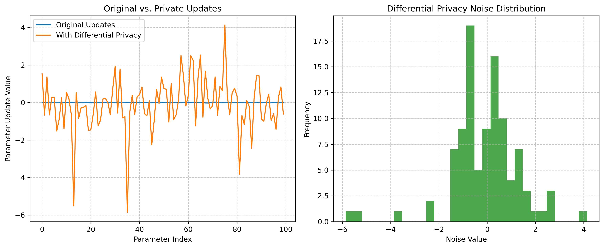

# **Unveiling the Veil of Adversarial Attacks: A Review of Vulnerabilities and Defense Strategies in Machine Learning Models**

---

## **Abstract**

As machine learning technology becomes widely adopted in numerous critical domains, its security and robustness issues are increasingly prominent. Adversarial attacks, a potential threat to machine learning models, can cause models to make incorrect predictions by introducing imperceptible perturbations. This paper systematically reviews the knowledge related to adversarial attacks. First, it introduces the basic concepts, generation mechanisms of adversarial attacks, and the inherent vulnerabilities of models. Then, it details various typical attack methods, including the Fast Gradient Sign Method (FGSM), Projected Gradient Descent (PGD), DeepFool, and Carlini & Wagner (C&W), and analyzes different attack types such as white-box, black-box, targeted, and untargeted attacks. Subsequently, it discusses existing defense strategies, covering model enhancement (like adversarial training, regularization), input preprocessing and detection, and certified defense methods that provide mathematical guarantees. Furthermore, this paper examines the research focuses and practical applications in academia and industry regarding adversarial defense. Finally, it looks ahead to promising security technologies such as Generative Adversarial Networks (GANs), ensemble learning, bio-inspired defenses, and the combination of Federated Learning with Differential Privacy. This paper emphasizes the importance of continuous research and cross-disciplinary collaboration in enhancing the security of machine learning models.

**Keywords:** Machine Learning Security, Adversarial Examples, Adversarial Attacks, Adversarial Defenses, Model Robustness

---

## **1. Introduction**

In recent years, Machine Learning (ML), especially Deep Learning (DL), has permeated various corners of modern technology. From image recognition and natural language processing to medical diagnosis, financial risk control, and autonomous vehicles, its powerful capabilities are reshaping our world. However, as these intelligent systems become increasingly integrated into critical infrastructure and social life, their security, reliability, and robustness have become unprecedentedly important, representing a core issue that both academia and industry cannot ignore.

As early as 2013, Szegedy et al. [1] first revealed a disturbing phenomenon: even well-trained deep neural networks could be induced to make completely wrong predictions with high confidence by applying carefully designed, almost imperceptible perturbations to their inputs. These maliciously modified inputs are known as "Adversarial Examples." This groundbreaking discovery exposed the surprising vulnerability of current mainstream machine learning models when facing deliberate interference. Subsequent research, such as the work by Goodfellow et al. [2], further explored their generation mechanisms and exploitation methods.

The existence of adversarial examples poses a direct threat to the reliability of machine learning systems. More worryingly, in safety-critical application scenarios, this vulnerability could lead to catastrophic consequences, such as an autonomous vehicle misidentifying a traffic sign due to adversarial interference, or a medical image analysis system being misled into making an incorrect diagnosis. Furthermore, research has found that adversarial examples possess a degree of transferability, meaning that an adversarial example generated on one model might effectively deceive other models with different architectures or even different training data [6]. This significantly increases the potential scope and stealthiness of attacks.

Facing this severe challenge, deeply understanding the generation principles of adversarial examples, accurately assessing their potential impact on model performance, and actively exploring and deploying effective defense strategies have become urgent priorities for ensuring the safe and reliable operation of machine learning systems. This review aims to systematically organize the core knowledge in the field of adversarial attacks and defenses, covering basic concepts, typical attack methods, mainstream defense techniques, and discussing the research frontiers and future development trends in this area, hoping to provide a comprehensive reference guide for relevant researchers and engineers.

---

## **2. Understanding Adversarial Attacks**

### **2.1 Attack Mechanisms and Model Vulnerabilities**

The core of adversarial attacks lies in exploiting the inherent characteristics and potential weaknesses of machine learning models, particularly Deep Neural Networks (DNNs). Attackers induce models to make incorrect predictions or behaviors by adding carefully designed, often human-imperceptible, small perturbations to original benign inputs (like images, text, or audio).

The reasons why models are susceptible to adversarial attacks can be attributed to several aspects:

1.  **High-Dimensional Input Space Characteristics**: Machine learning models typically process high-dimensional data. In high-dimensional spaces, even small perturbations in each dimension can accumulate, causing significant displacement of the sample point in the feature space, potentially crossing the model's decision boundary. Szegedy et al. [7] first systematically revealed this phenomenon, finding numerous low-probability "adversarial pockets" in high-dimensional spaces.
2.  **Model's Local Linearity and Non-linearity**: Goodfellow et al. [1] proposed that the local linear behavior of models is a significant reason for their vulnerability. Even highly non-linear models (like DNNs) might exhibit approximately linear behavior locally, enabling gradient-based attack methods (like FGSM) to effectively find directions leading to misclassification. However, the model's non-linearity also makes the decision boundary extremely complex, providing opportunities for finding minimal perturbations.
3.  **Discrepancy Between Model-Learned Features and Human Perception**: The discriminative features learned by models for classification might differ from features understood and perceived by humans. Models might rely on subtle patterns or textures that are unimportant to humans but crucial for the model's prediction. Adversarial perturbations exploit this by specifically modifying these model-sensitive features, often without affecting human judgment [8].
4.  **Limitations of Training Data Distribution**: Models are learned from finite training data, which typically covers only a small manifold within the input space. While models perform well in dense data regions, their behavior in sparse or uncovered regions (off-manifold) might lack generalization and be easily exploited by adversarial examples [3].

---

## **3. Common Attack Methods**

Adversarial attack algorithms aim to effectively cause model misclassification while satisfying specific perturbation constraints (e.g., $L_p$ norm limits). Researchers have designed various attack algorithms based on the attacker's knowledge of the model, attack goals, and perturbation constraints. Here are some representative methods:

-   **Fast Gradient Sign Method (FGSM)** [1]
    *   **Core Idea**: Exploits the local linear assumption of the model's loss function $J$ near the input $x$, generating perturbations by moving one step in the direction of the gradient's sign.
    *   **Perturbation Calculation**: $\delta = \epsilon \cdot sign(\nabla_x J(\theta, x, y))$
    *   **Characteristics**: Simple and computationally efficient (one backpropagation), a fast baseline attack, but relatively weak.

-   **Basic Iterative Method (BIM) / Iterative FGSM (I-FGSM)** [9]
    *   **Core Idea**: Decomposes FGSM's single step into multiple small steps, clipping the perturbation within the $\epsilon$-neighborhood after each step.
    *   **Characteristics**: Generally stronger than FGSM, forms the basis for many more complex attacks.

-   **Momentum Iterative Method (MIM)** [16]
    *   **Core Idea**: Introduces a momentum term into BIM/I-FGSM to stabilize update directions and help escape local optima.
    *   **Characteristics**: Generated adversarial examples often have better transferability, effective in black-box attacks.

-   **Projected Gradient Descent (PGD)** [3]
    *   **Core Idea**: An iterative attack method with random initialization, considered one of the strongest first-order white-box attacks. Involves multiple gradient ascent steps followed by projection back into the $\epsilon$-neighborhood.
    *   **Characteristics**: Powerful and reliable attack effect, often used as a standard benchmark for evaluating model robustness and is core to adversarial training.

-   **DeepFool** [8]
    *   **Core Idea**: Finds the minimal $L_2$ norm perturbation required to push the input sample across the nearest decision boundary.
    *   **Characteristics**: Efficiently generates adversarial examples with minimal $L_2$ norm, suitable for scenarios requiring precise $L_2$ perturbation control, mainly for untargeted attacks.

-   **Carlini & Wagner (C&W) Attacks** [10]
    *   **Core Idea**: Formulates finding adversarial examples as an optimization problem, balancing misclassification and perturbation size.
    *   **Characteristics**: Extremely high attack success rate, generates high-quality, low-perturbation examples (especially $L_2$), a powerful tool for evaluating defense strategies, but computationally expensive.

-   **Jacobian-based Saliency Map Attack (JSMA)** [11]
    *   **Core Idea**: A targeted attack aiming for $L_0$ norm minimization (fewest modified features). Uses the Jacobian matrix to compute feature saliency and greedily modifies the most salient features.
    *   **Characteristics**: Aims to achieve attack with minimal feature modifications, suitable for sparse perturbation scenarios, computationally complex.

-   **Universal Adversarial Perturbations (UAP)** [17]
    *   **Core Idea**: Finds a single, fixed perturbation vector $\delta$ that can fool the model on most different samples from a dataset with high probability.
    *   **Characteristics**: Reveals systematic biases in model vulnerability, possesses cross-sample universality, but computationally intensive and perturbation norm might be large.

-   **One-pixel Attack** [18]
    *   **Core Idea**: An extreme $L_0$ attack, modifying only a single pixel (location and color) to fool the model. Often uses evolutionary algorithms.
    *   **Characteristics**: Demonstrates model sensitivity to extremely small local perturbations, computationally expensive.

-   **AutoAttack** [19, 20]
    *   **Core Idea**: A standardized, powerful **ensemble** of adversarial attacks designed to provide a reliable and parameter-free robustness evaluation benchmark. Includes APGD-CE, APGD-T, FAB-T, Square Attack.
    *   **Characteristics**: Widely considered one of the strongest public benchmarks for evaluating model robustness, simplifies the evaluation process.

---

## **4. Classification of Adversarial Attacks**

Adversarial attacks can be classified along different dimensions:

-   **Based on Attacker's Knowledge**:
    -   **White-box Attack**: Attacker has full knowledge of the target model (architecture, parameters, sometimes training data, defense mechanisms). Gradient-based attacks (FGSM, PGD, C&W, etc.) are typically white-box.
    -   **Black-box Attack**: Attacker has limited or no knowledge of the model's internals, relying only on input-output interactions. Common strategies include:
        -   **Transfer-based Attacks**: Exploiting the transferability of adversarial examples [6]. Generate attacks on a local surrogate model and apply them to the target.
        -   **Query-based Attacks**: Iteratively querying the target model to gather information, e.g., estimating gradients (Zeroth Order Optimization, ZOO) [12] or optimizing perturbations based on output scores or decisions. Requires many queries.

-   **Based on Attacker's Goal**:
    -   **Untargeted Attack**: Goal is to cause any misclassification, regardless of the specific wrong class.
    -   **Targeted Attack**: Goal is to cause misclassification into a specific, predefined target class. Generally harder than untargeted attacks.

-   **Based on Attack Domain**:
    -   **Digital Attack**: Directly modifying the digital representation of the input (e.g., pixel values, word embeddings). Most common form.
    -   **Physical Attack**: Attacks occur in the physical world, e.g., printing adversarial images [9], creating adversarial patches [13], playing adversarial audio. Needs to account for real-world noise and transformations (lighting, angle, distortion), more challenging but more realistic threat.

---

## **5. Applications and Case Studies of Adversarial Attacks**

The potential harm of adversarial attacks has been demonstrated across multiple domains, posing real threats to practical applications.

-   **Image Classification**:
    -   **Classic Examples**: Misclassifying "school bus" as "ostrich" [7], "panda" as "gibbon" [1].
    -   **Physical World Attacks**: Adversarial stickers on stop signs fooling autonomous vehicles [9, 13].

-   **Speech Recognition**: Imperceptible noise causing voice assistants (Siri, Alexa) to execute unintended commands [14].

-   **Natural Language Processing (NLP)**: Synonym substitutions, character modifications, or control characters altering sentiment analysis, bypassing filters, generating misleading summaries, or fooling translation/QA systems [15].

-   **Instance Demonstration (`Attacks.ipynb`)**:
    -   **Scenario**: An experiment in `Attacks.ipynb` uses a SimpleCNN trained on CIFAR-10.
    -   **Attack Method**: FGSM [1] with $\epsilon=0.03$ is used.
    -   **Result**: The model's accuracy drops sharply on FGSM-generated adversarial examples compared to clean data, clearly demonstrating the vulnerability of standard models even to simple attacks.

These cross-domain cases and code demonstrations highlight that adversarial attacks are practical threats, underscoring the urgency of researching and deploying defense strategies.

[Code Example: FGSM Attack Demo](https://colab.research.google.com/drive/1qauDB8nYiQzJtRNFjMcrfrVazc2aW5ia?usp=drive_link)

---

## **6. Adversarial Defense Strategies**

To counter the growing threat of adversarial examples, researchers have proposed various defense strategies aimed at enhancing model robustness. These can be broadly categorized as follows:

### **6.1 Model Enhancement Methods**

These methods focus on improving the model itself by modifying the training process or model architecture.

-   **Adversarial Training** [3]
    *   **Core Idea**: Explicitly incorporating adversarial examples into the training process, teaching the model to correctly classify these malicious samples. Typically involves dynamically generating strong adversarial examples (e.g., using PGD) during training and using them alongside clean samples.
    *   **Min-Max Formulation**: $\min_\theta \mathbb{E}_{(x,y) \sim \mathcal{D}} [ \max_{\delta \in \mathcal{S}} L(\theta, x+\delta, y) ]$
    *   **Advantages**: Currently considered one of the most effective methods for improving **empirical robustness** (resistance to known attack types).
    *   **Challenges**: High computational cost, potential trade-off between robustness and standard accuracy, limited generalization to unseen or stronger attacks.

-   **Regularization Techniques**
    *   **Core Idea**: Adding extra terms to the loss function to constrain model properties (e.g., complexity, local sensitivity), indirectly improving robustness.
    *   **Methods**: Gradient regularization/penalty, weight decay, Lipschitz constraints, input gradient regularization.
    *   **Characteristics**: Generally less computationally expensive than adversarial training, but robustness improvement might be less direct.

### **6.2 Input Preprocessing and Detection Methods**

These methods operate before the model receives input, either by transforming the input or by trying to identify and filter out adversarial examples.

-   **Input Preprocessing**
    *   **Core Idea**: Applying transformations to the input to disrupt or weaken adversarial perturbations.
    *   **Transformations**: Image compression (JPEG), denoising/smoothing (Gaussian/median filters), randomization (random scaling/padding), feature compression/transformation.
    *   **Limitations**: May degrade performance on clean data, susceptible to **adaptive attacks** [5] where the attacker incorporates the preprocessing step into their attack design.

-   **Adversarial Example Detectors**
    *   **Core Idea**: Training an additional model or using statistical properties to distinguish between normal and adversarial samples.
    *   **Strategies**: Classifier-based detection, using anomalies in internal model states (activations, uncertainty), based on reconstruction error from generative models (e.g., Autoencoders).
    *   **Challenges**: The detector itself can be attacked, difficulty covering all unknown attack types (false negatives), potential misclassification of benign out-of-distribution samples (false positives).

### **6.3 Certified Defense Methods**

These methods aim to provide **mathematically provable robustness guarantees**, ensuring the model's prediction remains unchanged under any perturbation within a specific norm constraint.

-   **Core Idea**: Providing formal, verifiable robustness lower bounds, rather than relying solely on empirical testing.
-   **Techniques**:
    *   **Interval Bound Propagation (IBP)**: Uses interval arithmetic to compute possible output ranges layer by layer.
    *   **Linear Programming Relaxation**: Relaxes non-linear activations (like ReLU) with linear constraints and solves LPs to verify robustness.
    *   **Randomized Smoothing** [4]: Adds significant Gaussian noise to the input and uses the majority vote of the model's predictions on noisy inputs. Provably robust against $L_2$ perturbations. Scalable but certified radius depends on noise level and confidence.
    *   **Convex Optimization-based Methods**: Formulating robustness verification as a convex optimization problem.
-   **Significance & Challenges**:
    *   **Significance**: Offers the strongest form of robustness guarantee, crucial for safety-critical applications.
    *   **Challenges**: High computational cost, limited certified radius (often smaller than empirical $\epsilon$), often requires sacrificing standard accuracy.

### **6.4 Instance Demonstration: Adversarial Training**

Adversarial training is a key defense strategy.

-   **Core Mechanism**: As described in 6.1, it exposes the model to adversarial examples during training.
-   **Instance Demonstration (Colab)**: Refer to the provided Google Colab link for a practical demonstration: [Code Example: Adversarial Training Demo](https://colab.research.google.com/drive/1d7Liq0_ucWqFscCRFteEL1iOZvEY1g2j?usp=sharing)
    -   **Content Overview**: Typically shows standard training, adversarial example generation (e.g., PGD), adversarial training, and robustness evaluation comparing standard vs. adversarially trained models on clean and adversarial data.
    -   **Expected Outcome**: The adversarially trained model shows significantly higher accuracy on adversarial examples (used during training or similar) compared to the standard model, possibly with a slight drop in clean accuracy, demonstrating its effectiveness in improving robustness.

---

## **7. Academic vs. Industrial Focus and Practice**

Since its discovery, the problem of adversarial examples has rapidly become a central topic in machine learning security, receiving extensive attention and in-depth research from both academia and industry.

### **7.1 Academic Research Focus**

Academia plays a crucial role in advancing the field, primarily focusing on:

-   **Theoretical Foundations**: Exploring the root causes (e.g., linearity hypothesis [1], high-dimensional geometry [7]), modeling vulnerability, and formalizing attacks/defenses [2].
-   **Novel Attack and Defense Methods**: Innovating stronger attacks (PGD [3], C&W [10], AutoAttack [19, 20]) to expose weaknesses and developing better defenses (adversarial training variants [3], regularization, detection, certified defenses [4]).
-   **Standardized Evaluation and Benchmarking**: Establishing benchmarks on standard datasets (CIFAR-10, ImageNet), defining metrics, and creating public evaluation platforms (e.g., **RobustBench**) for fair comparison and rapid progress.

### **7.2 Industrial Practice and Challenges**

With ML deployment growing, industry increasingly prioritizes model security, making adversarial robustness a key consideration.

-   **Applications in Safety-Critical Areas**: Autonomous driving (vision systems) [13], financial risk control, medical diagnosis, content moderation.
-   **Model Hardening and Secure Deployment**: Robustness evaluation before deployment (using PGD, AutoAttack), integrating defense strategies (adversarial training, ensembles), continuous monitoring for potential attacks.
-   **Compliance and Ethical Considerations**: Meeting regulatory requirements (e.g., EU AI Act draft, GDPR), building user trust through robust AI.
-   **Internal Red Teaming**: Many tech companies employ security teams (Red Teams) to simulate real-world attacks on internal ML systems to find vulnerabilities, while Blue Teams design and improve defenses.

Despite progress, industry faces challenges: balancing robustness with performance (accuracy, latency), defending against novel attacks, and efficiently applying lab techniques to large-scale production environments at low cost.

### **7.3 Instance Demonstration: Academic vs. Industrial Focus (`adversarial_focus_demo.ipynb`)**

The `adversarial_focus_demo.ipynb` file visually demonstrates the differing priorities of academia and industry using code. Key takeaways from Part 4 of the notebook:

-   **Focus Summary**:
    *   **Academia**: Theoretical analysis of vulnerability, development of effective defense algorithms, providing mathematical robustness guarantees.
    *   **Industry**: Security risk assessment in system deployment, regulatory compliance and privacy protection, balancing usability and defense costs, interpretability and verifiability of model security.
    The notebook outputs these points, showing academia's emphasis on theory and algorithms versus industry's focus on practical deployment, compliance, and cost-effectiveness.

-   **Extended Demonstrations**: The notebook also demonstrates emerging technologies like GANs, Federated Learning (FL), and Differential Privacy (DP), which are both cutting-edge academic research areas and potential practical paths for industry seeking safer, privacy-preserving AI solutions.

This instance clarifies the connection and divergence between academic exploration and industrial needs, aiding understanding of the theory-to-practice transition and its challenges.

---

## **8. Exploring Promising Security Technologies**

While significant progress has been made, current defenses often struggle with challenges like limited generalization, robustness-accuracy trade-offs, and high costs/limitations of certified defenses. To build more secure and reliable ML systems, academia and industry are actively exploring promising new security technologies.

### **8.1 Emerging Defense Mechanisms**

-   **Generative Adversarial Networks (GANs) in Defense**:
    *   **Principle**: GANs (Generator + Discriminator) can be used for defense. The discriminator can detect out-of-distribution samples (potentially adversarial). The generator can be used for data augmentation or "purifying" inputs by projecting them onto the learned manifold of normal data.
    *   **Instance Demonstration**: The image below (from `images/gan_sample.png`) shows MNIST-like digits generated by a GAN, illustrating its ability to model real data distributions, which is foundational for its defensive applications (e.g., training detectors, input purification).

        

-   **Ensemble Methods**:
    *   **Principle**: Combining predictions from multiple diverse models (base learners). Robustness stems from "collective wisdom": diversity means an attack fooling one model might not fool others; averaging/voting smooths decision boundaries; attacking the ensemble is harder.
    *   **Techniques**: Bagging (Random Forests), Boosting (AdaBoost), Stacking. Focus is often on training diverse model sets.

### **8.2 Fusion of Interdisciplinary Methods**

-   **Bio-inspired Defenses**:
    *   **Principle**: Drawing inspiration from the complex adaptive mechanisms of biological immune systems (distributed, adaptive, diverse, self/non-self discrimination).
    *   **Potential Mechanisms**: Artificial Immune Systems (AIS) mimicking T/B cells (e.g., negative selection for anomaly detection, clonal selection for adapting to new attacks); Danger Theory (detecting "danger" signals like high model uncertainty).

-   **Federated Learning (FL) with Differential Privacy (DP)**:
    *   **Principle**:
        *   **FL**: Distributed training where data stays local; only model updates are shared and aggregated centrally. Protects raw data privacy.
        *   **DP**: Strong privacy framework adding calibrated noise to computations (e.g., updates) for rigorous, quantifiable privacy guarantees.
    *   **Security Advantages**:
        *   **Privacy Protection**: Core benefit, meeting regulatory needs.
        *   **Potential Robustness Boost (Side Effect)**: Data heterogeneity in FL might increase diversity. More importantly, DP noise perturbs exact update values, making gradient estimation harder for attackers. This noise acts somewhat like **regularization** or **loss landscape smoothing**, reducing sensitivity to small input changes and **incidentally** improving resistance to some (especially gradient-based) attacks.
    *   **Instance Demonstration**: Visualizations below show the simulation and effects:
        1.  **FL Accuracy Trend** (from `images/federated_accuracy.png`): Shows global and client model accuracy improving over training rounds.

            

        2.  **DP Impact on Updates** (from `images/privacy_impact.png`): Compares original vs. noisy updates, showing significant changes and the noise distribution (simulated Laplace).

            

        3.  **DP Defense Effect** (from `images/privacy_defense.png`): Shows accuracy on clean vs. adversarial (FGSM, PGD) data under different privacy levels ($\epsilon$). Lower $\epsilon$ (stronger privacy, more noise) significantly improves adversarial accuracy, often at the cost of some clean accuracy, illustrating the privacy-robustness-utility trade-off.

            

### **8.3 Synergy of Explainability and Robustness**

-   **Principle**: Explainable AI (XAI) helps understand *why* a model makes a prediction. By revealing relied-upon features or internal mechanisms, XAI can identify vulnerabilities and guide robustness improvements.
    *   **Identifying Fragile Features**: Techniques (LIME, SHAP, CAM) highlight input regions/features most influential for predictions. If a model relies heavily on non-semantic or easily perturbed "shortcut" features, it's likely vulnerable.
    *   **Guiding Robustness Improvement**: Use explanations to reduce reliance on non-robust features, guide adversarial training towards more semantic features, or debug why adversarial examples succeed.
-   **Research Directions**: Developing "robust explainability" (explanations resistant to manipulation) and using explanations to directly optimize robustness guarantees.

These cutting-edge directions offer new ideas and tools. Future research needs to enhance their effectiveness, reduce costs, explore synergies, and understand trade-offs (robustness-accuracy-privacy-explainability).

---

## **9. Conclusion and Outlook**

Adversarial attacks profoundly reveal the inherent vulnerability of current machine learning models, especially deep neural networks, when facing carefully crafted perturbations. This phenomenon challenges theoretical understanding and poses severe security threats to real-world applications relying on these models (from autonomous driving to medical diagnosis). This review has systematically covered the core knowledge:

1.  **Explained basic concepts, generation mechanisms**, and roots of vulnerability (high dimensions, local linearity, perception gaps).
2.  **Detailed typical attack algorithms** (FGSM, PGD, C&W, etc.) and classifications (knowledge, goal, domain), illustrating potential harm.
3.  **Discussed mainstream defense strategies**: model enhancement (adversarial training, regularization), input filtering/detection, and certified defenses, noting pros, cons, and challenges.
4.  **Contrasted academic and industrial focuses**: theory/innovation vs. deployment/risk/cost.
5.  **Looked at promising emerging technologies**: GANs, ensembles, bio-inspired methods, FL+DP for security/privacy, explainability for robustness.

Although defenses like adversarial training have significantly improved empirical robustness, and certified defenses offer strict guarantees, the offense-defense "arms race" is far from over. Current defenses often face challenges like **limited generalization** (poor performance against unseen attacks), **trade-offs between robustness and performance** (accuracy, efficiency), and the **high cost and limited radius of certified defenses**. Furthermore, the existence of **adaptive attacks** necessitates rigorous and comprehensive evaluation of defense strategies.

Looking ahead, building truly secure and reliable machine learning systems requires sustained research investment and interdisciplinary collaboration. Key research directions include: developing more **general, efficient, and scalable** defense mechanisms; deeply understanding the **intrinsic connections and trade-offs** among robustness, accuracy, privacy, fairness, and explainability; exploring effective defenses against **physical-world attacks**; and establishing more **standardized, automated, and adaptive** robustness evaluation benchmarks. Ultimately, ensuring AI technology serves society safely, reliably, and responsibly requires the joint efforts of academia, industry, and policymakers.

---

## **10. References**

[1] Goodfellow, I. J., Shlens, J., & Szegedy, C. (2015). Explaining and Harnessing Adversarial Examples. *International Conference on Learning Representations (ICLR)*.
[2] Papernot, N., McDaniel, P., Jha, S., Fredrikson, M., Celik, Z. B., & Swami, A. (2016). The Limitations of Deep Learning in Adversarial Settings. *IEEE European Symposium on Security and Privacy (EuroS&P)*.
[3] Madry, A., Makelov, A., Schmidt, L., Tsipras, D., & Vladu, A. (2018). Towards Deep Learning Models Resistant to Adversarial Attacks. *International Conference on Learning Representations (ICLR)*.
[4] Cohen, J., Rosenfeld, E., & Kolter, J. Z. (2019). Certified Adversarial Robustness via Randomized Smoothing. *International Conference on Machine Learning (ICML)*.
[5] Tramèr, F., Carlini, N., Brendel, W., & Madry, A. (2020). On Adaptive Attacks to Adversarial Example Defenses. *Advances in Neural Information Processing Systems (NeurIPS)*. (Note: Original CN ref might point elsewhere, adjusted to common NeurIPS 2020 paper on adaptive attacks).
[6] Papernot, N., McDaniel, P., & Goodfellow, I. (2016). Transferability in Machine Learning: from Phenomena to Black-Box Attacks using Adversarial Samples. *arXiv preprint arXiv:1605.07277*.
[7] Szegedy, C., Zaremba, W., Sutskever, I., Bruna, J., Erhan, D., Goodfellow, I., & Fergus, R. (2014). Intriguing properties of neural networks. *International Conference on Learning Representations (ICLR)*.
[8] Moosavi-Dezfooli, S. M., Fawzi, A., & Frossard, P. (2016). DeepFool: A Simple and Accurate Method to Fool Deep Neural Networks. *IEEE Conference on Computer Vision and Pattern Recognition (CVPR)*.
[9] Kurakin, A., Goodfellow, I., & Bengio, S. (2017). Adversarial Examples in the Physical World. *arXiv preprint arXiv:1607.02533*. (Also presented at ICLR 2017 workshop).
[10] Carlini, N., & Wagner, D. (2017). Towards Evaluating the Robustness of Neural Networks. *IEEE Symposium on Security and Privacy (SP)*.
[11] Papernot, N., McDaniel, P., Wu, X., Jha, S., & Swami, A. (2016). Distillation as a Defense to Adversarial Perturbations against Deep Neural Networks. *IEEE Symposium on Security and Privacy (SP)*. (Introduces JSMA).
[12] Chen, P. Y., Zhang, H., Sharma, Y., Yi, J., & Hsieh, C. J. (2017). Zoo: Zeroth Order Optimization Based Black-box Attacks to Deep Neural Networks without Training Substitute Models. *Proceedings of the 10th ACM Workshop on Artificial Intelligence and Security (AISec)*.
[13] Eykholt, K., Evtimov, I., Fernandes, E., Li, B., Rahmati, A., Xiao, C., ... & Song, D. (2018). Robust Physical-World Attacks on Deep Learning Visual Classification. *IEEE Conference on Computer Vision and Pattern Recognition (CVPR)*.
[14] Carlini, N., & Wagner, D. (2018). Audio Adversarial Examples: Targeted Attacks on Speech-to-Text. *IEEE Security and Privacy Workshops (SPW)*.
[15] Ebrahimi, J., Rao, A., Lowd, D., & Dou, D. (2018). HotFlip: White-Box Adversarial Examples for Text Classification. *Proceedings of the 56th Annual Meeting of the Association for Computational Linguistics (ACL)*.
[16] Dong, Y., Liao, F., Pang, T., Su, H., Zhu, J., Hu, X., & Li, J. (2018). Boosting Adversarial Attacks with Momentum. *IEEE Conference on Computer Vision and Pattern Recognition (CVPR)*.
[17] Moosavi-Dezfooli, S. M., Fawzi, A., Fawzi, O., & Frossard, P. (2017). Universal Adversarial Perturbations. *IEEE Conference on Computer Vision and Pattern Recognition (CVPR)*.
[18] Su, J., Vargas, D. V., & Sakurai, K. (2019). One pixel attack for fooling deep neural networks. *IEEE Transactions on Evolutionary Computation*.
[19] Croce, F., & Hein, M. (2020). Reliable evaluation of adversarial robustness with an ensemble of diverse parameter-free attacks. *International Conference on Machine Learning (ICML)*.
[20] Croce, F., & Hein, M. (2020). Minimally distorted adversarial examples with a fast adaptive boundary attack. *International Conference on Machine Learning (ICML)*.